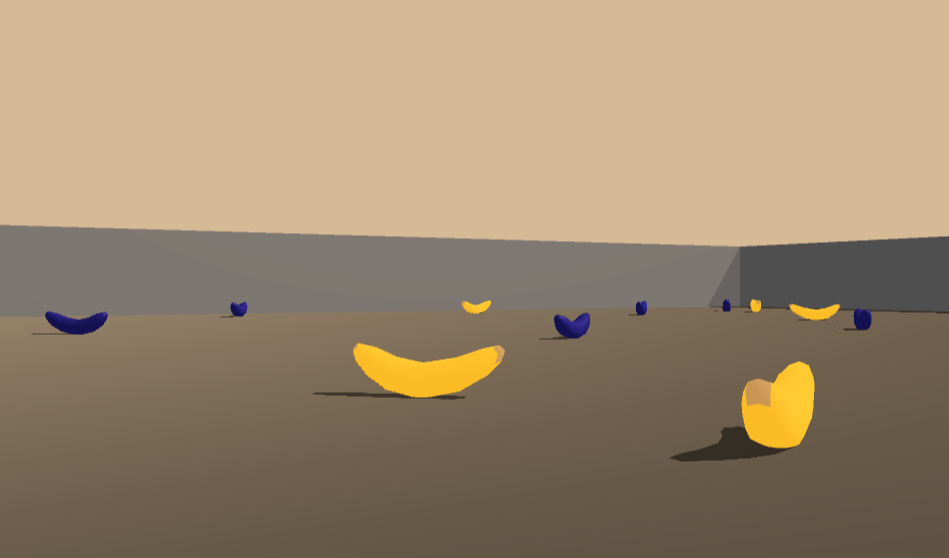
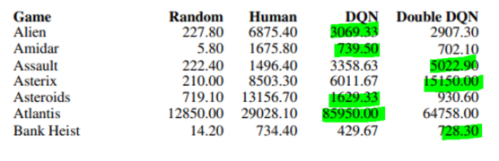
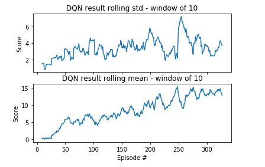
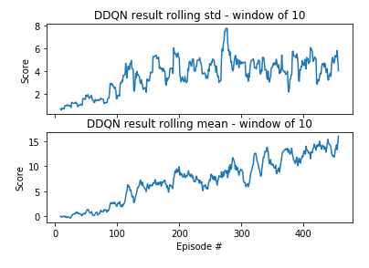
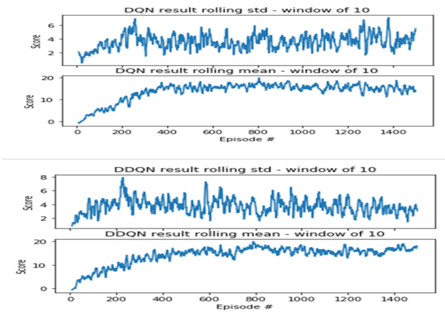

# Deep Reinforcement Learning on banana collector

## Banana collector navigation using DQN/Double DQN
Using Unity ML-Agents. 
[link to banana collector!](https://github.com/Unity-Technologies/ml-agents/blob/master/docs/Learning-Environment-Examples.md#banana-collector)


For this project, agent will be trained to navigate and collect bananas in a sqare world.

Reward as follows:
A reward of +1 is provided for collecting a yellow banana, and a reward of -1 is provided for collecting a blue banana. 

Objective of agent:
```
Thus, the goal of your agent is to collect as many yellow bananas as possible while avoiding blue bananas.
```

State space in the environment:
```
Number of state space : 37
Vector of state space type : continuous
The state space has 37 dimensions and contains the agent's velocity, along with ray-based perception of objects around the agent's forward direction. 
```

State space :
__Number of state space : 37__
```
[ 1.          0.          0.          0.          0.84408134  0.          0.    1.          0.          0.0748472   0.          1.          0.          0.]
```

*Action space:*
__Number of action space : 4__
```
0 - move forward.
1 - move backward.
2 - turn left.
3 - turn right
```


Completion of successful agent:
```
The task is episodic, and in order to solve the environment, agent must get an average score of +13 over 100 consecutive episodes.
```


## Algorithm of Double DQN vs DQN 

Deep Q-Network is a popular technique when coming to training agent to play famous games like Atari, however issue such as overestimation is a factor that could degrade the performance of agent using DQN alone.

Double DQN is able to reduce overestimation problem (overoptimism) in DQN using technique of target network as reference.

Reference : Minh et al. 2015 https://arxiv.org/pdf/1509.06461.pdf 



Figure above show that highlighted green is the higher score of the game. DQN shown to be better in certain cases . In banana collector , benchmark will be conducted by implementing both DQN and DDQN to see the comparison of both algorithm.


## Content of this repository
* __report.pdf__: a document that describes the details of the different implementation, along with ideas for future work.
* jupyter notebook __Banana_Navigator/Navigation.ipynb__: Notebook to run agent learning at DQN and DDQN with the switch at agent class DDQN=False (DQN) and DDQN=True (DDQN).
* __checkpoint_ddqn.pth__ : Weight file that has the trained agent using DDQN.
* __checkpoint_dqn.pth__ : Weight file that has the trained agent using DQN.
* __requiremets.txt__ : File for dependencies . Can run trhough pip install -r requirements.txt

 


## Requirements

### Getting Started

1. Download the environment from one of the links below.  You need only select the environment that matches your operating system:
    - Linux: [click here](https://s3-us-west-1.amazonaws.com/udacity-drlnd/P1/Banana/Banana_Linux.zip)
    - Mac OSX: [click here](https://s3-us-west-1.amazonaws.com/udacity-drlnd/P1/Banana/Banana.app.zip)
    - Windows (32-bit): [click here](https://s3-us-west-1.amazonaws.com/udacity-drlnd/P1/Banana/Banana_Windows_x86.zip)
    - Windows (64-bit): [click here](https://s3-us-west-1.amazonaws.com/udacity-drlnd/P1/Banana/Banana_Windows_x86_64.zip)
    
    (_For Windows users_) Check out [this link](https://support.microsoft.com/en-us/help/827218/how-to-determine-whether-a-computer-is-running-a-32-bit-version-or-64) if you need help with determining if your computer is running a 32-bit version or 64-bit version of the Windows operating system.

    (_For AWS_) If you'd like to train the agent on AWS (and have not [enabled a virtual screen](https://github.com/Unity-Technologies/ml-agents/blob/master/docs/Training-on-Amazon-Web-Service.md)), then please use [this link](https://s3-us-west-1.amazonaws.com/udacity-drlnd/P1/Banana/Banana_Linux_NoVis.zip) to obtain the environment.

2. Place the file in the DRLND GitHub repository, in the `p1_navigation/` folder, and unzip (or decompress) the file. 

### Instructions

Follow the instructions in `Banana_Navigator/Navigation.ipynb` to get started with training your own agent! 


## Expected result 

```Deep Q-network rolling standard deviation and rolling mean reward graph```




```Double Deep Q-network rolling standard deviation and rolling mean reward graph```




```DQN vs DDQN stability in rewards over 1500 episodes```


